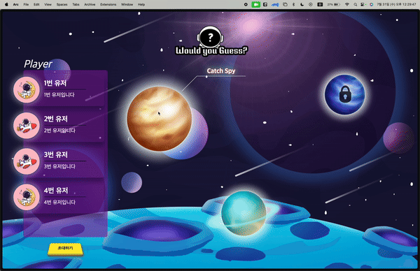
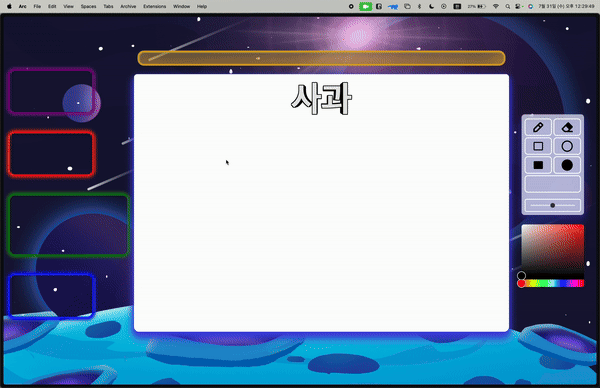
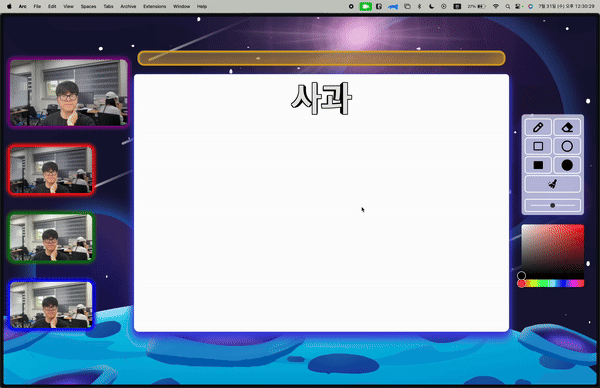
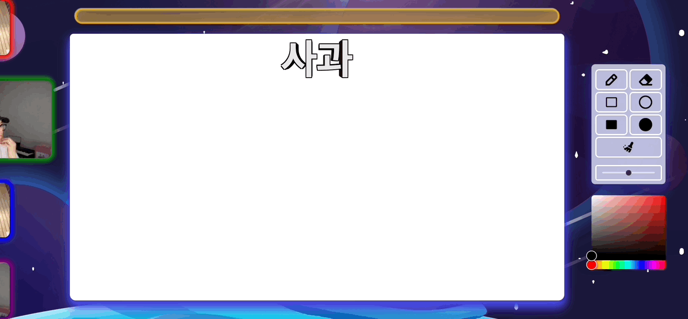
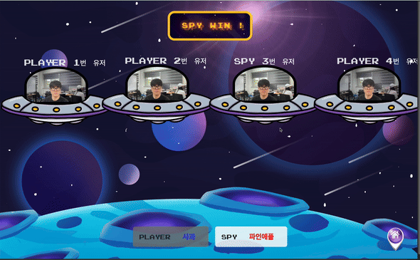
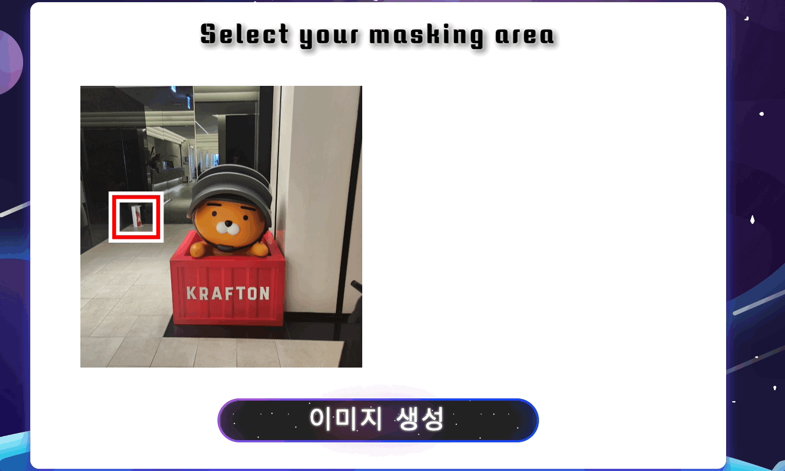
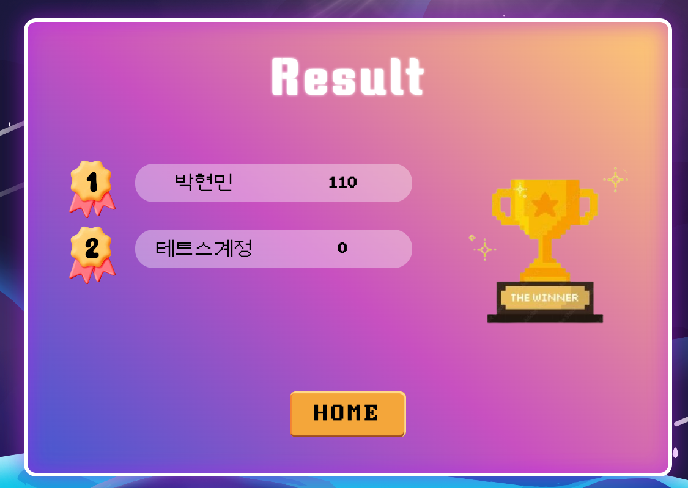
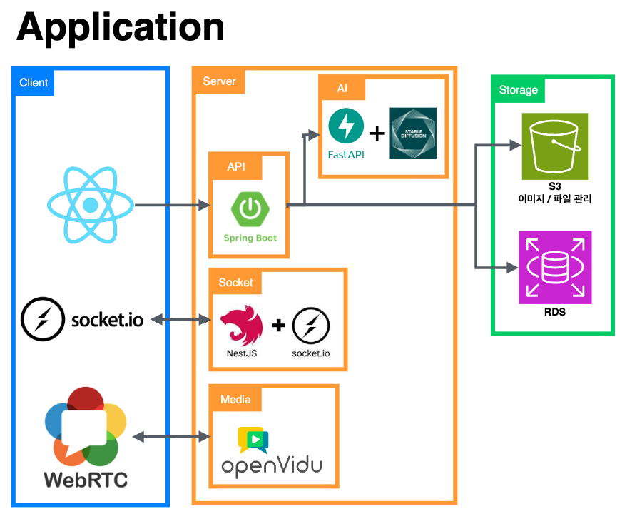
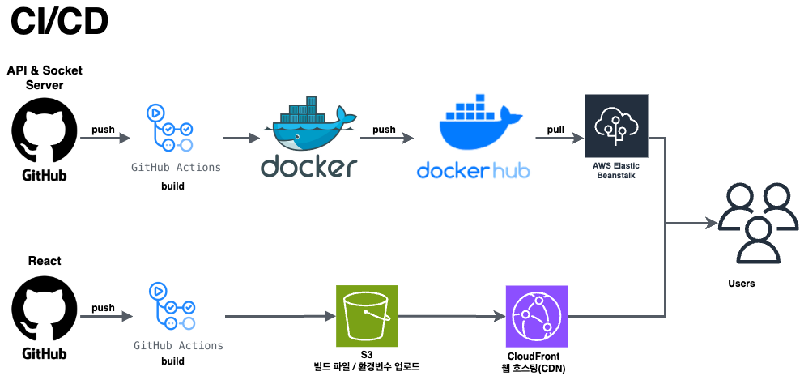
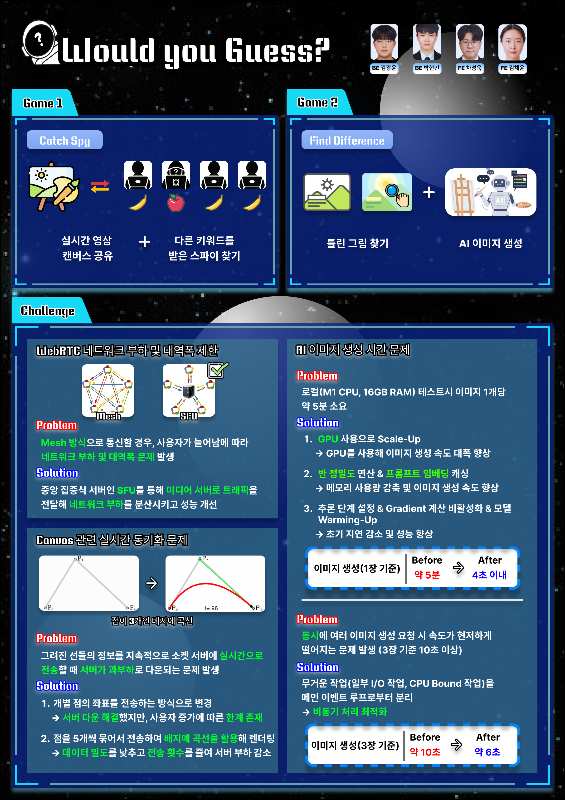

<h2>[크래프톤 정글 5기] Wouldyouguess?</h2>
친한 친구, 동료들과 함께 즐길 수 있는 그림🖼️ & 이미지📷 기반 웹 서비스

## 목차

- [개요](#개요)
- [게임 설명](#게임-설명)
- [게임 플레이 방식](#게임-플레이-방식)
- [발표 영상](#발표-영상)
- [아키텍처](#아키텍처)
- [포스터](#포스터)

## 개요

- 프로젝트 이름 : Wouldyouguess? 🚀
- 프로젝트 지속기간 : 2024.06.27 ~ 2024.07.27 (4주)
- 개발 환경 : React, Java, Nest
- 멤버 : 김광윤, 김채윤, 박현민, 차성욱

## 게임 설명

|  |  |
|:--------------------------------------------------------------:|:--------------------------------------------------------------:|
|                             시작 화면                              |                             로비 화면                              |

### 1번 게임(Catch Spy)

|  |         |
|:----------------------------------------------------------------:|:---------------------------------------------------------------------:|
|                              키워드 안내                              |                              플레이어 순서 안내                               |
|                             |      |
|                              그림 그리기                              |                              레이저 펜(낙서하기)                              |
|                             |  |
|                             회의 및 투표                              |                                 결과 화면                                 |

### 2번 게임(Find Difference)

|         |  |
|:-----------------------------------------------------------------------:|:---------------------------------------------------------------------:|
|                                 이미지 업로드                                 |                           이미지 마스킹 및 이미지 생성                            |
|  |      |
|                                틀린 그림 찾기                                 |                                 결과 화면                                 |

일상에서 친구나 동료들과 함께 잠시 쉬어가며 사진과 그림을 통해 가볍게 즐길 수 있는 게임을 만들고자 우주게스(Wouldyouguess?)를 개발하게 됐습니다. 

[//]: # (- 모험과 힐링을 동시에 즐겨라! ⚔️ )

[//]: # (  소소빌리지에선 모험과 힐링을 동시에 즐길 수 있다는 특징이 있습니다. 기본 홈&#40;Home&#41;맵에서는 작물도 기르고 요리도 할 수 있으며, 숲&#40;Forest&#41;에서는 나무, 두더지 등의 몬스터와 싸우고 낚시를 통해)

[//]: # (  물고기를 얻을 수도 있습니다. 이 과정을 통해 캐릭터는 생산물을 얻고 성장할 수 있습니다.)

[//]: # (- 다양한 미니게임을 즐겨라! 🎯 )

[//]: # (  각 스테이지별로 다양한 종류의 미니게임을 통해 하나의 게임에서 여러 재미를 향유할 수 있습니다. 이 게임의 목적은 플레이어의 지속되는 생활을 위한 물품을 얻는 것에 있습니다.)

[//]: # (- 자유를 즐겨라! 🏄🏻 )

[//]: # (  캐릭터는 높은 자율성을 가집니다. 특정 일에 대해 강제성을 부여하지 않고 오직 캐릭터의 활동만으로 게임이 진행됩니다. 예를 들어 낚시에 흥미를 느낀다면, 낚시에 빠져들어 최강의 어부가 될 수 있습니다. 어떠한)

[//]: # (  제약도 소소빌리지에서는 존재하지 않습니다.)

[//]: # (- 초보자도 누구나! 👶 )

[//]: # (  높은 자율성이 존재하는 만큼 처음 플레이하게 되었을 때 낯섦을 느낄 수 있습니다. 소소빌리지는 모든 게임 화면에서 설명을 기재하였으며 언제든지 궁금한 경우 열람할 수 있도록 하였습니다. 더불어 모든 상황에 대한)

[//]: # (  경고를 해주어, 예기치 못한 일을 방지할 수 있습니다.)

## 게임 플레이 방식

- **Game1 (Catch Spy)**  
  **1. 키워드 확인**: 게임이 시작되면 화면 중앙에 당신에게 부여된 키워드가 나타납니다. 
  **2. 스파이 숨기기**: 스파이를 제외한 모든 플레이어는 동일한 키워드를 받습니다. 스파이는 다른 키워드를 받지만, 자신이 스파이인지 모릅니다. 😉 
  **3. 그림 그리기**: 자신의 차례가 되면 부여받은 키워드를 그림으로 표현합니다. 
  **4. 비밀 대화**: 그림을 그리는 플레이어를 제외한 나머지 플레이어들은 펜을 사용하여 낙서하며 비밀 대화를 나눌 수 있습니다. 
  **5. 스파이 찾기**: 모든 플레이어가 그림을 그린 후, 각자의 그림을 보며 회의하고 스파이로 의심되는 사람에게 투표합니다. 
  **6. 승리 조건**: 스파이를 찾아내면 플레이어들의 승리! 찾아내지 못하면 스파이의 승리입니다. 
   
  **추가 정보**
    - 그림 실력보다는 키워드를 얼마나 잘 이해하고 표현하는지가 중요합니다.
    - 낙서와 대화를 통해 다른 플레이어들과 협력하여 스파이의 단서를 찾아보세요.
    - 스파이는 최대한 다른 플레이어들의 그림과 비슷하게 그려야 합니다.
       
       

- **Game2 (Find Difference)**  
  **1. 사진 업로드**: 게임을 시작하고 원하는 사진을 선택하여 업로드합니다. 📸 
  **2. 마스킹 영역 선택**: 사진의 왼쪽 위에서 오른쪽 아래 방향으로 드래그하여 변경할 영역을 선택합니다. 
  **3. 이미지 생성 요청**: 마스킹 영역을 확인한 후, 버튼을 눌러 이미지 생성을 요청합니다. 
  **4. 귀여운 오리 영상**: 이미지 생성 시간 동안 귀여운 오리 영상을 감상하세요! 🦆 
  **5. 이미지 확인 및 게임 시작**: 생성된 이미지가 마음에 들면 준비완료 버튼을 누릅니다. 마음에 들지 않으면 다시 생성할 수 있습니다. 
  **6. 차이점 찾기**: 다른 플레이어들과 함께 원본 이미지와 생성된 이미지를 비교하며 틀린 부분을 찾아내세요. (원본 이미지는 점점 희미해집니다!) 
  **7. 결과 확인**: 모든 라운드가 종료되면 결과 화면에서 플레이어들의 점수를 확인할 수 있습니다. 🏆 
   
  **추가 정보**
    - 마스킹 영역을 신중하게 선택하여 난이도를 조절할 수 있습니다.
    - 틀린 부분을 빨리 찾을수록 더 높은 점수를 얻을 수 있습니다.
    - 희미해지는 원본 이미지를 잘 활용하여 차이점을 찾아보세요.
       
       

## 발표 영상

<a href="https://youtu.be/OTDst73LYHs?si=ecBMSHJwPYuIIKQM">유투브 링크</a>

## 아키텍처

 

## 포스터

